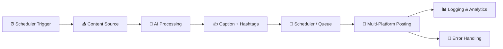

# 🚀 Social Media AI Automation (Full Stack Workflow)

> ⚡ End-to-End AI-powered system to create, schedule, publish & manage content across multiple platforms — fully automated.

---

## 🌐 Live Demo

🔗 **Explore the Project:**
👉 [https://manpreet1singh2.github.io/Social-media-automation-workflow-/](https://manpreet1singh2.github.io/Social-media-automation-workflow-/)

---

## 🧠 What This Project Does

This is a **full-stack AI automation system built in n8n** that handles the entire social media lifecycle:

✔ Content Creation
✔ Caption + Hashtag Generation
✔ Multi-Platform Publishing
✔ Scheduling & Queue Management
✔ Analytics & Logging
✔ Error Handling & Alerts

👉 **Zero manual posting. 100% automation.**

---

## ⚡ Core Capabilities

### 🤖 AI Content Engine

* Generates captions automatically
* Creates platform-specific content
* Adds smart hashtags

---

### 📅 Smart Scheduling System

* Queue-based posting
* Time-optimized publishing
* Consistent content delivery

---

### 📢 Multi-Platform Automation

Supports:

* LinkedIn
* Instagram
* Facebook
* Twitter (X)

---

### 🔄 Full Automation Pipeline

* Fetch → Process → Generate → Post → Track
* No manual intervention required

---

### 📊 Analytics & Tracking

* Post logs stored
* Performance tracking ready
* Expandable for dashboards

---

### 🚨 Error Handling System

* Fail-safe nodes
* Alerts for failed executions
* Reliable automation flow

---

## 🧠 Workflow Architecture



---

## 🧩 Advanced Workflow Modules

### 🔹 Content Pipeline

* RSS / API / Manual input
* Content transformation

### 🔹 AI Processing Layer

* Caption generation
* Hashtag optimization

### 🔹 Distribution Engine

* Platform-specific posting nodes
* Parallel execution

### 🔹 Monitoring System

* Logs stored in Google Sheets / DB
* Alert system integrated

---

## 📂 Project Structure

```
📦 Social-Media-AI-Automation
 ┣ 📄 social_media_automation_workflow.json
 ┣ 📄 ContentQueue_template.csv
 ┣ 📄 index.html
 ┣ 📄 README.md
```

---

## 🚀 Setup (Production Ready)

### 1️⃣ Import Workflow

* Open **n8n**
* Click **Import**
* Upload JSON file

---

### 2️⃣ Configure APIs

* 📧 Email / Alerts
* 📱 Social Media APIs
* 🧠 AI (OpenAI / custom)
* 📊 Google Sheets (logging)

---

### 3️⃣ Activate Automation

* Enable **Schedule Trigger**
* Run once for testing
* Activate workflow

---

## 📊 Example Output

| Platform  | Content                | Status      |
| --------- | ---------------------- | ----------- |
| LinkedIn  | AI Automation Post     | ✅ Published |
| Instagram | Marketing Reel Caption | ⏳ Scheduled |
| Twitter   | Growth Thread          | ✅ Posted    |

---

## 🔐 Security & Deployment

* 🔒 No unnecessary data retention
* 🏠 Fully self-hostable (n8n)
* 🔐 Secure API integrations
* ⚙️ Production-ready architecture

---

## 🧩 Tech Stack

* ⚙️ n8n (Automation Engine)
* 🧠 AI APIs (OpenAI / LLMs)
* 🌐 REST APIs (Social Platforms)
* 📊 Google Sheets / DB
* 🧾 CSV Queue System

---

## 🎯 Use Cases

* 📢 Personal Branding Automation
* 🏢 Business Social Media Management
* 📈 Marketing Agencies
* 🤖 AI Content Systems

---

## 🚀 Future Scope

* 🤖 Fully AI-generated posts (text + images)
* 📊 Advanced analytics dashboard
* 🎯 Auto engagement (comments/replies)
* 🔔 Telegram / Slack alerts

---

## 💼 Why This Project Matters

👉 Saves **5–10 hours/week**
👉 Ensures **consistent posting**
👉 Improves **engagement & reach**
👉 Scales social media effortlessly

---

## 🤝 Contributing

PRs are welcome. Open an issue before major changes.

---

## ⭐ Support

If this impressed you:
⭐ Star the repo
🔁 Share with others
🤝 Collaborate with me

---

## 👨‍💻 Author

**Manpreet Singh**
🚀 Full Stack & AI Automation Developer

📧 [dimplebrar13@gmail.com](mailto:dimplebrar13@gmail.com.com)
🌐 [https://portfolio.com](https://v0-portfolio-project-idea-lake.vercel.app/)

---

## 💡 Final Thought

> “The future of growth is automated. The future of content is AI.”

🔥 **Build once. Automate forever. Scale without limits.**
